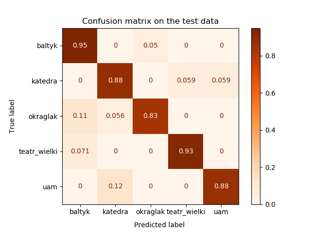

# **Buildings_classifier**

In the repository there is a final project (the first of two) made during advanced image processing classes at the Poznan University of Technology. The aim of the project was the classification of the five most most popular buildings in Poznan based on Bags of visual words.

Class names of considered buildings:
|Baltyk|Katedra|Okraglak|Uam|Teatr Wielki|
|:----:|:-----:|:------:|:-:|:----------:|
||||||

## **Requirements**
- python 3.7.5
- numpy 1.18.3
- opencv-python 4.2.0
- scikit-learn 0.22.2.post1

## **Result**
The best result on this test dataset was obtained for SVM classifier. 
Image width have been set to 700px and number of words in dictionary to 440.

Final accuracy and confusion matrix:

|              |  Accuracy [%]  |
|:------------:|:--------------:|
| Test data    |    89.41       | 
| Train data   |     100        | 

